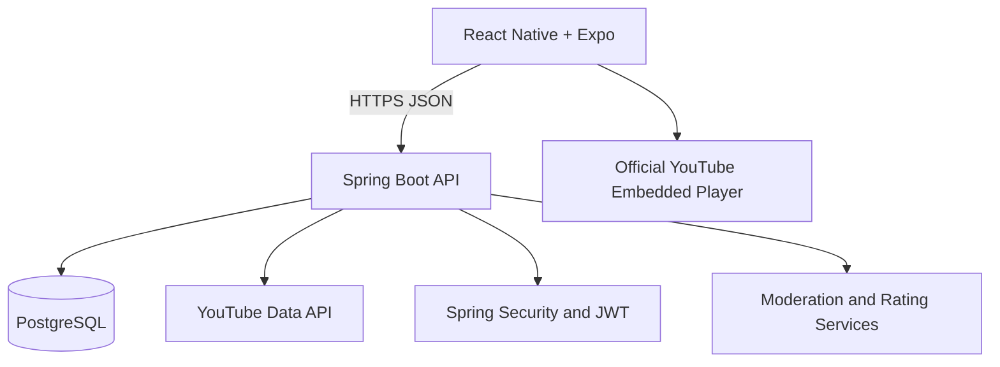

# GentleScreen

GentleScreen is a parent-reviewed, low-stimulation video platform for intentional screen time. It gives families a finite catalog of manually curated YouTube videos, understandable GentleScreen ratings, parent-owned child profiles, and timed viewing sessions—without unrestricted search, endless feeds, autoplay chains, ads, or child accounts.

> This repository is in Phase 1: the foundation is runnable, while authentication, catalog curation, playback, ratings, and moderation are deliberately staged for subsequent reviewable phases.

## Preview

Screenshots will be added after the parent-authentication and curated-catalog flows are implemented.

## Architecture



The mobile application will play videos directly in the official YouTube embedded player. GentleScreen's backend retrieves permitted metadata and enforces catalog approval; it never proxies YouTube video or audio. See [the architecture notes](docs/architecture.md) and [implementation plan](docs/IMPLEMENTATION_PLAN.md).

## Technology

- Mobile: Expo SDK 57, React Native 0.86, React 19, TypeScript, Expo Router, TanStack Query, Zustand, React Hook Form, Zod, SecureStore
- API: Java 21, Spring Boot 4.1, Spring Web, Security, JPA, Validation, Actuator, Flyway, springdoc OpenAPI
- Data: PostgreSQL 17 locally; Neon PostgreSQL is the production target
- Delivery: Docker Compose, GitHub Actions, Render backend blueprint, EAS configuration
- Tests: JUnit 5 / Spring Boot Test / Testcontainers foundation; Jest / React Native Testing Library

## Prerequisites

- Docker Desktop (recommended for the API and PostgreSQL)
- Java 21 for running the API without Docker (the included wrapper supplies Maven)
- Node.js 22.13+ and npm for Expo
- Expo Go or an iOS/Android simulator for mobile development

## Environment setup

Copy `.env.example` to `.env`, then replace the local passwords and `JWT_SECRET`. Leave `YOUTUBE_API_KEY` empty during Phase 1. Never put secrets in an `EXPO_PUBLIC_*` variable because Expo bundles those values into the client.

For mobile-only development, create `mobile/.env` with:

```dotenv
EXPO_PUBLIC_API_URL=http://localhost:8080/api/v1
```

On a physical device, replace `localhost` with the development machine's LAN address.

## Start PostgreSQL and the API with Docker

```bash
docker compose up --build
```

The safe health endpoint is available at `http://localhost:8080/actuator/health`. Stop the stack with `docker compose down`; add `--volumes` only when you intentionally want to delete local database data.

## Database migrations

Flyway runs automatically when the API starts. The baseline is `backend/src/main/resources/db/migration/V1__baseline.sql`. Never modify an applied migration; add a new versioned migration for each schema change.

To validate the backend locally without Docker Compose:

```bash
cd backend
./mvnw verify
```

The default profile expects PostgreSQL at `localhost:5432`. The automated application test uses the isolated `test` profile; integration tests using Testcontainers are added with the first persistence slice.

## Run the mobile app

```bash
cd mobile
npm install
npm start
```

Then scan the Expo QR code or open an installed simulator. The current shell demonstrates the calm design system and the parent/child navigation boundaries; it intentionally does not simulate working authentication.

## Run mobile validation

```bash
cd mobile
npm run typecheck
npm run lint
npm test
npm run validate:expo
```

## API documentation

With the API running, Swagger UI is at `http://localhost:8080/swagger-ui.html` and the OpenAPI document is at `http://localhost:8080/v3/api-docs`. Only infrastructure endpoints exist in Phase 1; versioned `/api/v1` feature endpoints begin in Phase 2.

## Deployment overview

- Backend: create a Render Blueprint from `infrastructure/render.yaml`, point it to the repository, and configure the marked secret environment values.
- Database: create separate Neon PostgreSQL databases for production and non-production, require SSL, and supply the JDBC URL and credentials to Render.
- Mobile: connect the Expo project, replace the placeholder bundle identifiers if needed, and use profiles in `mobile/eas.json`.
- Deploy only reviewed commits after CI passes. Never place a production secret in the image or repository.

## YouTube integration constraints

GentleScreen stores YouTube identifiers and permitted metadata only. It does not download, host, retransmit, extract, proxy, edit, recolor, or desaturate videos. Playback must use the official embedded player with no overlay, frame, touch interceptor, timer, close button, or other element covering any portion of it. Required YouTube branding, controls, ads, and links must not be hidden. Timers and GentleScreen controls belong outside the player boundary.

Only videos that are both manually `APPROVED` and reported as embeddable may appear in the child catalog. GentleScreen ratings are separate from YouTube metadata and must be labeled as GentleScreen ratings.

## Privacy and launch warning

The account belongs to the parent; child profiles use a nickname, age band, and generic avatar. Do not collect a child's email, phone, exact location, contacts, voice, photos, school, or advertising identifiers. The MVP includes no ad SDKs or behavioral analytics in child mode.

This software is not medical advice and does not claim developmental appropriateness. Privacy policy, terms, verifiable parental consent, deletion, export, retention, app-store, child-safety, and YouTube API compliance require qualified legal and security review before any public launch.

## Known limitations

- Phase 1 contains no account or PIN implementation, seeded users, curated catalog, YouTube API calls, playback, timers, favorites, playlists, ratings, reports, or moderation UI.
- The first Flyway migration establishes only identity/profile primitives; feature tables arrive with their vertical slices.
- Production deployment values and Expo project identifiers are intentionally unconfigured.
- Screenshots and full end-to-end coverage wait until primary flows stabilize.

## Roadmap

1. Parent registration, login, refresh-token rotation, logout, and PIN security
2. Parent-owned child profiles and curated catalog workflow
3. Official embedded playback and application-level session timers
4. Favorites, playlists, watch history, and GentleScreen ratings
5. Reviewer/moderator workflows, reports, and audit events
6. Privacy controls, accessibility review, observability, and production hardening
