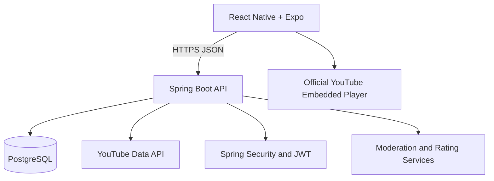

# Architecture

The mobile app loads playback directly through the official YouTube embedded player. The API retrieves permitted metadata and applies GentleScreen curation rules; it never proxies, downloads, retransmits, or transforms video or audio.

The backend remains one modular monolith. Feature packages own their controllers, services, repositories, domain models, DTOs, and mappers. PostgreSQL is the system of record, and every schema change is applied through Flyway.

